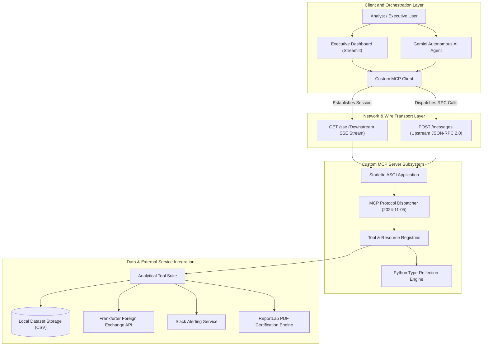
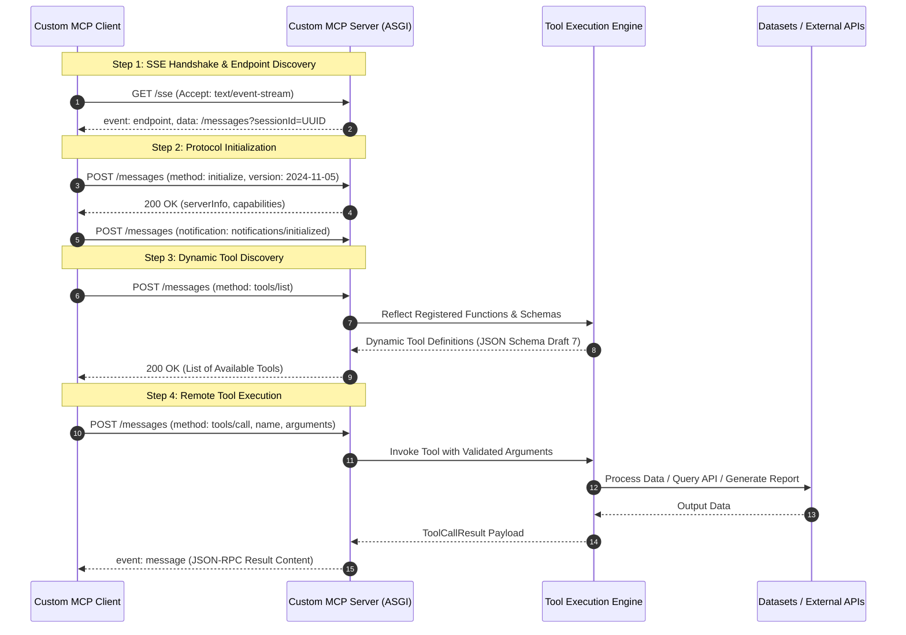

# Autonomous Data Analyst Platform (Custom MCP Architecture)

An enterprise-grade business intelligence, dataset auditing, and automated reporting system built from the ground up utilizing a proprietary **Model Context Protocol (MCP)** implementation. The architecture strictly conforms to the **MCP Specification `2024-11-05`** over **JSON-RPC 2.0** and **HTTP / Server-Sent Events (SSE)** transport layers, completely independent of third-party MCP SDK dependencies.

---

## Architecture Overview

The system is decoupled into two independent, networked subsystems: a high-throughput **Custom MCP Server** hosting business analytics tools and dataset resources, and an **AI-Orchestrated Client / Dashboard** responsible for planning, reasoning, and executing analytical pipelines.

### System Architecture Diagram



---

## Protocol Communication Lifecycle

The interaction between the client and server adheres strictly to the stateful JSON-RPC 2.0 session lifecycle over HTTP/SSE:



---

## Repository Structure

```text
mcp-analyst/
├── server/
│   ├── protocol/
│   │   ├── jsonrpc.py          # JSON-RPC 2.0 specification models (Request, Response, Error, Notification)
│   │   ├── types.py            # MCP protocol schema models conforming to Specification 2024-11-05
│   │   └── registry.py         # Dynamic reflection engine, ToolRegistry, and MCPDispatcher
│   ├── transport/
│   │   └── sse_server.py       # Starlette ASGI Server with session management (GET /sse, POST /messages)
│   ├── tools/
│   │   └── analyst_tools.py    # Core business analytics tools and dataset resource providers
│   └── server.py               # Standalone MCP Server application entry point
│
├── client/
│   ├── transport/
│   │   └── sse_client.py       # Async HTTP/SSE client transport and JSON-RPC promise dispatcher
│   ├── mcp_client.py           # High-level CustomMCPClient interface
│   └── client_runner.py        # Gemini-powered autonomous agent execution runner
│
├── data/                       # Operational and financial CSV datasets for analysis
├── outputs/reports/            # Target destination for generated Markdown and PDF audit reports
├── tests/
│   ├── test_full_suite.py      # Unit, reflection, schema sanitization, and tool logic tests
│   └── test_custom_mcp_network.py # Network integration tests executing over live SSE connections
│
├── utils/
│   └── pdf_generator.py        # ReportLab executive PDF layout and certification engine
├── app.py                      # Executive Streamlit Web Dashboard
├── requirements.txt            # Python runtime dependencies
└── README.md                   # Formal system documentation
```

---

## Core Analytical Capabilities

The custom MCP server exposes a specialized suite of enterprise analytical tools:

1. **`preview_dataset`**: Performs comprehensive structural introspection of CSV datasets, reporting dimensions, column datatypes, missing value distributions, memory footprint, and preview records.
2. **`detect_anomalies`**: Executes statistical Z-score outlier detection and rule-based business validation (e.g., negative revenue constraints, transaction spikes).
3. **`generate_segment_matrix`**: Produces multi-dimensional cohort and pivot cross-tabulations across categories, regions, and channels.
4. **`fetch_live_fx_rates`**: Queries the Frankfurter Foreign Exchange API for institutional currency conversion rates and baseline benchmarks.
5. **`export_audit_summary`**: Synthesizes pipeline findings into formatted Markdown documentation and a formal, certified Executive PDF report.
6. **`dispatch_slack_alert`**: Sends structured incident and audit notifications to configured webhook communication channels.

---

## Installation and Environment Setup

### 1. Prerequisites
- Python 3.10 or higher
- Git

### 2. Environment Configuration
Clone the repository and configure the required environment variables:

```bash
git clone https://github.com/sydelendure/mcp-analyst.git
cd mcp-analyst
```

Create a virtual environment:
```bash
python3 -m venv venv
source venv/bin/activate
```

Install project dependencies:
```bash
pip install -r requirements.txt
```

### 3. Environment Variables
Copy `.env.example` to `.env` and supply the required configuration keys:

```bash
cp .env.example .env
```

Edit `.env` with your credentials:
```ini
# Google Gemini API Key (Required for AI Copilot reasoning)
GEMINI_API_KEY=your_gemini_api_key_here

# Slack Webhook URL (Optional for alerting)
SLACK_WEBHOOK_URL=https://hooks.slack.com/services/YOUR/SLACK/WEBHOOK_URL
```

---

## Verification and Testing

Execute the automated test suite to validate protocol compliance, schema reflection, and live network communications:

```bash
python -m unittest discover -s tests
```

Expected output:
```text
PASS: Handshake, ping, and tool discovery over custom SSE transport succeeded.
PASS: Remote execution of all core analytical tools over custom MCP network passed.
PASS: PDF Generator generated valid certified report.
PASS: extract_function_schema accurately reflected Python types into JSON Schema Draft 7.
PASS: MCPDispatcher correctly handled initialize, tools/list, tools/call and errors.
PASS: sanitize_schema stripped unsupported OpenAPI properties.
PASS: list_available_datasets correctly discovered local datasets.
PASS: preview_dataset successfully inspected dataset schemas.
PASS: fetch_live_fx_rates returned live exchange rates.
PASS: detect_anomalies identified business rule violations and statistical outliers.
PASS: generate_segment_matrix calculated cross-tabulation matrix successfully.
PASS: export_audit_summary wrote both .md and .pdf reports to disk.
----------------------------------------------------------------------
Ran 13 tests in ~1.0s (OK)
```

---

## Operating Instructions

The architecture operates across two decoupled processes:

### Step 1: Launch the Custom MCP Server (Terminal 1)
```bash
python server/server.py
```
*The server initializes an ASGI instance listening on `http://127.0.0.1:8000` with the SSE stream at `/sse`.*

### Step 2: Execute Client Applications (Terminal 2)

#### Option A: Interactive Web Dashboard
```bash
streamlit run app.py
```
*Access the executive dashboard at `http://localhost:8501`.*

#### Option B: Autonomous AI Copilot Pipeline
```bash
python client/client_runner.py
```
*Executes an autonomous data auditing and reporting workflow using Google Gemini connected to the MCP Server.*

#### Option C: Standalone MCP Client Verification
```bash
python client/mcp_client.py
```
*Performs an end-to-end handshake, ping, tool discovery, and sample tool execution.*

---

## Compliance and Security

- **Zero Third-Party MCP Lock-In**: Implemented purely using standard Python asynchronous primitives, Starlette ASGI, and standard JSON-RPC 2.0 serialization.
- **Session Isolation**: Each connected client is assigned an isolated UUID session ID with decoupled event queues.
- **Secret Protection**: API credentials and webhook endpoints are decoupled from application logic and managed strictly through environment variables.